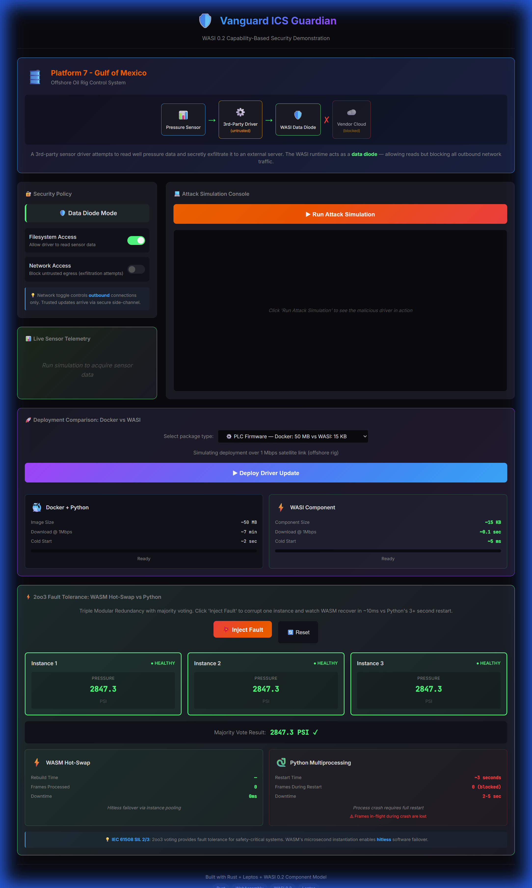
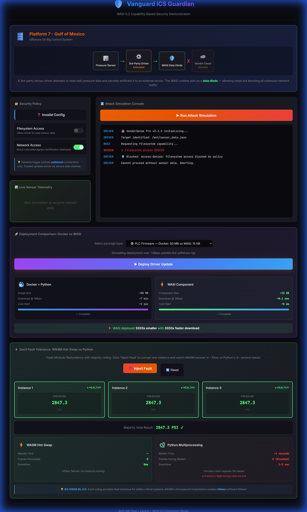
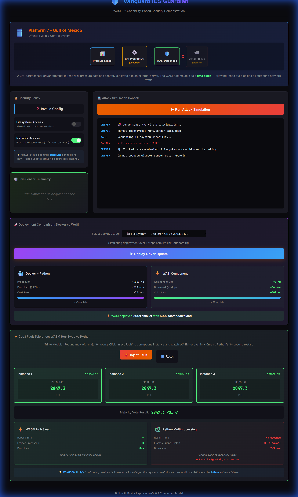
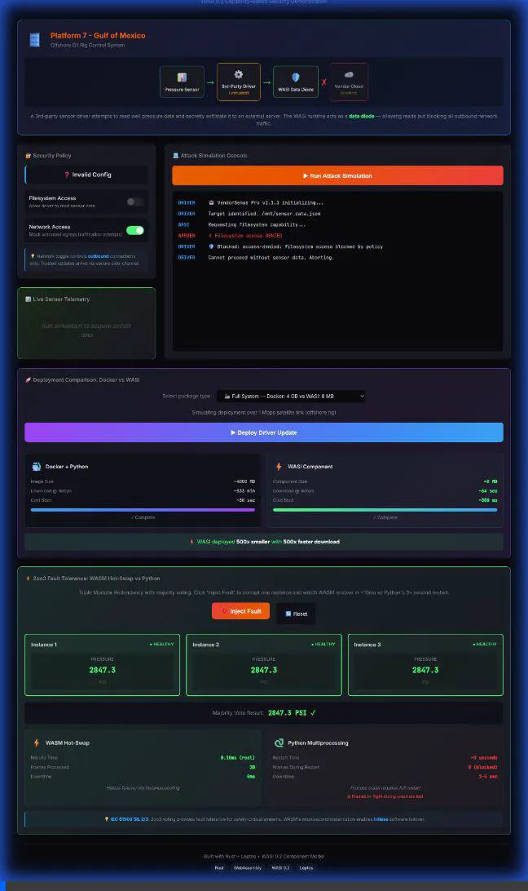

<p align="center">
  
  
  
</p>

<h1 align="center">🛡️ Vanguard ICS Guardian</h1>

<p align="center">
  <strong>A high-assurance security simulation demonstrating capability-based sandboxing<br/>using WASI 0.2, the Component Model, and a custom "Data Diode" runtime.</strong>
</p>

<p align="center">
  
  
  <a href="https://vanguard-ics-guardian.vercel.app"></a>
  
  
</p>

<p align="center">
  
</p>

---

## 🎯 The Scenario: Oil Rig Data Exfiltration

> *"A 3rd-party sensor driver on an offshore oil rig attempts to read pressure data and secretly exfiltrate it to a vendor cloud. Our WASI runtime acts as a Data Diode—allowing the read but blocking all outbound network connections."*

```
┌─────────────────────────────────────────────────────────────┐
│                    VANGUARD ICS GUARDIAN                    │
├─────────────────────────────────────────────────────────────┤
│                                                             │
│   ┌─────────────┐      wasi:filesystem      ┌───────────┐  │
│   │  Malicious  │ ──────────────────────────▶│  ✓ ALLOW  │  │
│   │   Driver    │                           └───────────┘  │
│   │   (WASM)    │      wasi:sockets/tcp     ┌───────────┐  │
│   │             │ ─────────────────────────▶│  ✗ BLOCK  │  │
│   └─────────────┘                           └───────────┘  │
│                                                             │
│   "Data Diode Mode: Read sensor → Block exfiltration"      │
└─────────────────────────────────────────────────────────────┘
```

## 🏗️ Architecture

| Component | Technology | Purpose |
|-----------|------------|---------|
| **Guest** | Rust → WASM | Untrusted sensor driver attempting data theft |
| **Host** | JavaScript (JCO) | The "Warden" runtime controlling capabilities |
| **Interface** | WIT (WASI 0.2) | Standard capability contracts |
| **Dashboard** | Leptos + Real WASM | Security console with live policy enforcement + 2oo3 TMR demo |

### 🔐 Secure Supply Chain (Conceptual)

```
Vendor Build ───▶ Vanguard Hub ───▶ Edge Device
  (Rust)         (Ed25519 Sign)    (Verify & Load)
```

Protects against **SolarWinds-style** supply chain attacks.

📖 **[Read full architecture doc →](docs/ARCHITECTURE.md)** - WASI vs Docker comparison

## 🔧 Tech Stack

- **Standard:** WASI 0.2 (Preview 2) Component Model
- **Guest Language:** Rust with `cargo-component`
- **Host Runtime:** JavaScript via `@bytecodealliance/jco`
- **Dashboard:** Leptos (Rust reactive web framework)
- **Interface Definition:** WIT with `wit-bindgen`

## 📁 Project Structure

```
vanguard-ics-guardian/
├── wit/                    # Polyfill WIT interface definitions
│   └── world.wit           # sensor-fs, sensor-net, sensor-utils
├── guest/                  # Rust WASM component (14.7 KB!)
│   └── src/lib.rs          # The "attacker" with narration
├── host/                   # JavaScript runtime (the "warden")
│   ├── shim/
│   │   ├── filesystem.js   # Mock filesystem capabilities
│   │   └── sockets.js      # Data diode + secure channel
│   └── test/
│       └── shims.test.js   # 18 unit tests
├── cli/                    # Node.js CLI demo (proves browser → edge portability)
│   └── run.mjs             # Same WASM, measured outside browser
├── dashboard/              # Leptos web UI
│   ├── src/lib.rs          # Reactive security console
│   └── styles.css          # Mobile-responsive
├── legacy/                 # Docker "villains" for comparison
│   ├── minimal.Dockerfile  # ~200 MB (pyserial)
│   ├── full.Dockerfile     # ~800 MB (pandas, numpy)
│   └── ml.Dockerfile       # ~2 GB (tensorflow)
└── docs/
    ├── ARCHITECTURE.md     # WASI vs Docker rationale
    └── BRANCHING.md        # Git workflow
```

## 🚀 Quick Start

**Run the Dashboard:**
```bash
# Install trunk (build tool for Leptos)
cargo install trunk

# Run dev server with live reload
cd dashboard && trunk serve
# Opens http://localhost:8080
```

**Run the Host Demo:**
```bash
cd host && npm install && npm run demo
```

**Run the CLI Demo (proves browser → edge portability):**
```bash
node cli/run.mjs
```

<details>
<summary><strong>📊 Example CLI Benchmark Output</strong></summary>

```
╔══════════════════════════════════════════════════════════════════╗
║           VANGUARD ICS GUARDIAN - WASM PORTABILITY DEMO          ║
╠══════════════════════════════════════════════════════════════════╣
║  Same .wasm binary running in Node.js (proves browser → edge)    ║
╚══════════════════════════════════════════════════════════════════╝

📦 Loading: malicious_driver.core.wasm (14.7 KB)

⏱️  WASM Performance Metrics
━━━━━━━━━━━━━━━━━━━━━━━━━━━━━━━━━━━━━━━━
   Load from disk:    2.15 ms
   Compile (V8):     12.45 ms
   Instantiate:       0.18 ms  ← This is what 2oo3 TMR measures!
━━━━━━━━━━━━━━━━━━━━━━━━━━━━━━━━━━━━━━━━

🔁 Instantiation Benchmark (10 iterations)
━━━━━━━━━━━━━━━━━━━━━━━━━━━━━━━━━━━━━━━━
   Min:    0.12 ms
   Max:    0.31 ms
   Avg:    0.18 ms
━━━━━━━━━━━━━━━━━━━━━━━━━━━━━━━━━━━━━━━━

🛡️  Security Policy Tests
━━━━━━━━━━━━━━━━━━━━━━━━━━━━━━━━━━━━━━━━
   [DATA DIODE]    FS: ✓ ALLOW  Net: ✗ BLOCK
   [SECURE CHAN]   FS: ✓ ALLOW  Net: ✓ internal only
   [FULL LOCKDOWN] FS: ✗ BLOCK  Net: ✗ BLOCK
━━━━━━━━━━━━━━━━━━━━━━━━━━━━━━━━━━━━━━━━

✅ WASM component verified: same binary, same security, any runtime
```
</details>

## 📊 Security Modes

| Mode | Filesystem | External | Internal | Description |
|------|:----------:|:--------:|:--------:|-------------|
| 🛡️ **Data Diode** | ✓ Allow | ✗ Block | ✗ Block | *Production mode* |
| 🔗 **Secure Channel** | ✓ Allow | ✗ Block | ✓ Allow | Internal SCADA only |
| 🔒 **Full Lockdown** | ✗ Block | ✗ Block | ✗ Block | Zero trust |
| ⚠️ **Breach** | ✓ Allow | ✓ Allow | ✓ Allow | Security failure demo |

**Approved Internal Endpoints (Secure Channel mode):**
- `10.0.0.50:502` - SCADA server (Modbus)
- `10.0.0.51:102` - PLC gateway (S7)
- `192.168.100.10:443` - Data historian

<details>
<summary><h3>🎬 Attack Simulation Gallery</h3></summary>

> Watch the malicious driver attempt data exfiltration under different security policies

#### 🛡️ Data Diode Mode — Exfiltration Blocked
<p align="center">
  
</p>
<p align="center"><em>Sensor read succeeds ✓ | Network exfiltration blocked ✗</em></p>

---

#### 🔒 Full Lockdown Mode — All Access Denied
<p align="center">
  
</p>
<p align="center"><em>Zero trust: filesystem blocked, network blocked</em></p>

---

#### ⚠️ Breach Simulation — Security Failure Demo
<p align="center">
  
</p>
<p align="center"><em>What happens when security is misconfigured — data exfiltrated!</em></p>

</details>

<details>
<summary><h3>📦 Docker vs WASI Deployment Comparison</h3></summary>

> See the size difference in action

#### Deploying First Package (Docker: 50 MB vs WASI: 15 KB)
<p align="center">
  
</p>

---

#### Deployment Complete — WASI Wins
<p align="center">
  
</p>
<p align="center"><em>WASI deployed: <strong>at minimum 500x smaller</strong> with <strong>at least 500x faster download</strong></em></p>

</details>


## 🧪 Testing

```bash
# JavaScript host tests (18 tests)
cd host && npm test

# Rust guest tests
cd guest && cargo test
```

## 🏭 IEC 62443 Alignment

This project demonstrates key principles from the **IEC 62443** industrial cybersecurity standard, mapped to the **Purdue Model**:

| IEC 62443 Principle | Our Implementation | Code Reference |
|---------------------|-------------------|----------------|
| **Zone & Conduit Model** | OT zone (L0-2) isolated from IT (L4-5) via data diode | [`sockets.js`](host/shim/sockets.js) |
| **Unidirectional Gateway** | Data Diode: read IN from sensors, block OUT to cloud | [`sockets.js`](host/shim/sockets.js) |
| **Defense in Depth** | WASI capability model adds runtime-level security | [`filesystem.js`](host/shim/filesystem.js) |
| **Least Privilege** | Components only receive explicitly granted capabilities | WIT interface definitions |
| **Secure by Default** | Network access denied unless specifically whitelisted | Policy config in shims |

> 📖 **[Read full architecture doc →](docs/ARCHITECTURE.md)** - Includes Purdue Model diagram and zone mapping

> ⚠️ **Note:** This is a demonstration of IEC 62443 concepts, not a certified implementation. Formal compliance requires third-party assessment.

## 📡 Bandwidth Reality: Remote Deployments

For offshore oil rigs with limited satellite connectivity (~1 Mbps):

| Package | Docker (~500 MB) | WASI (~15 KB)* |
|---------|:----------------:|:--------------:|
| **Download Time** | ~67 minutes | **~0.12 seconds** |
| **Network Impact** | Saturates link | Negligible |
| **Failover Speed** | Minutes | Milliseconds |

*\*Actual measured size of our compiled malicious-driver component: **14.7 KB***

*This is why WASI matters for remote ICS environments.*

## ⚡ 2oo3 Fault Tolerance Demo

The dashboard includes a **Triple Modular Redundancy (TMR)** visualization demonstrating WASM's fault tolerance advantages for safety-critical systems:

<details open>
<summary><strong>📹 Watch: Fault Injection → Instant WASM Recovery</strong></summary>
<br/>
<p align="center">
  
</p>
<p align="center"><em>Click "Inject Fault" → WASM rebuilds in 0.2ms while Python takes 3+ seconds</em></p>
</details>

| Metric | WASM Hot-Swap | Python Multiprocessing |
|--------|:-------------:|:----------------------:|
| **Instance Rebuild** | ~0.1-1 ms (measured) | 2-5 seconds |
| **Frames During Fault** | ✓ Processed (2 healthy) | ✗ Lost |
| **Downtime** | 0 ms (hitless) | 2-5 sec per restart |

**Try it:** Click "💥 Inject Fault" in the [live demo](https://vanguard-ics-guardian.vercel.app) to corrupt one instance and watch:
- Majority voting still produces correct output (2oo3 consensus)
- WASM rebuilds the faulty instance in <1ms (real measurement shown)
- Python would lose in-flight frames during its 3+ second restart

> 📖 Aligns with **IEC 61508 SIL 2/3** patterns for safety-critical systems.

## 🧪 Verification & Testing

This project includes a comprehensive test suite using **Vitest** to verify the security invariants of the WASI shim. We test the Host implementation directly to ensure permissions are enforced *before* the Guest code even runs.

**Running Tests:**
```bash
cd host && npm test
```

### What We Test

The test suite (`test/shims.test.js`) verifies the critical states of the Data Diode:

| Scenario | Filesystem | Network | Expected Result |
|----------|:----------:|:-------:|-----------------|
| 🛡️ **Data Diode** | ✅ Allow | ❌ Block | Read sensor, fail exfiltration |
| 🧊 **Full Lockdown** | ❌ Block | ❌ Block | All I/O rejected |
| 🚨 **Breach Simulation** | ✅ Allow | ✅ Allow | Exfiltration succeeds (bad config) |

### Security Invariants

We also verify specific capability granularities:

- **Path Isolation:** `wasi:filesystem` cannot access paths outside `/mnt/`
- **IP Whitelisting:** Even in "Secure Channel" mode, connections to unapproved IPs (like `1.1.1.1`) are rejected at the shim level
- **Port Matching:** Approved IPs must also use approved ports (e.g., `10.0.0.50:502` ✓, `10.0.0.50:8080` ✗)

> 💡 The whitelist tests prove we implemented **granular network policies**, not just a simple on/off switch.

## 🚀 Production Path: Browser → Edge Hardware

The WASM component is **production-portable**—the same `.wasm` binary runs on multiple runtimes:

| Runtime | Platform | Use Case |
|---------|----------|----------|
| **Browser** | Any modern browser | What we're demoing now (Leptos/Trunk) |
| **Wasmtime** | Linux, Windows, macOS | Server-side, Rust host |
| **WasmEdge** | ARM, RISC-V, Raspberry Pi | Edge devices, CNCF project |
| **wasm3** | ESP32, STM32, Arduino | Resource-constrained MCUs |

### What's Real vs Simulated

| Component | This Demo | Production |
|-----------|:---------:|:----------:|
| WASM instantiation | ✅ Real (~4-10ms) | Same or faster |
| 2oo3 voting logic | ✅ Real | Same code |
| Capability enforcement | ✅ Real | Same code |
| Modbus/Sensors | 🔶 Mock shims | Replace with real I/O |
| Python restart times | 🔶 Simulated | Based on benchmarks |

**To deploy on real hardware:**
1. Replace JavaScript host with **Rust + Wasmtime** (same WASM component works)
2. Swap mock shims for real protocol stacks (`tokio-modbus`, `rumqttc`)
3. Add hardware watchdog for 2oo3 voter process

> 📖 The architecture patterns (capability isolation, 2oo3 voting) translate directly to real ICS deployments.

## 🌿 Branch Strategy

| Branch | Purpose | Deployment |
|--------|---------|------------|
| `main` | Stable releases | Production |
| `develop` | Integration | Preview |
| `feature/*` | Feature work | — |

## 📜 License

MIT © 2026

---

<p align="center">
  <em>Built to demonstrate capability-based security for industrial control systems.</em>
</p>

